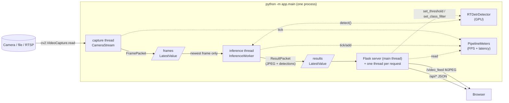
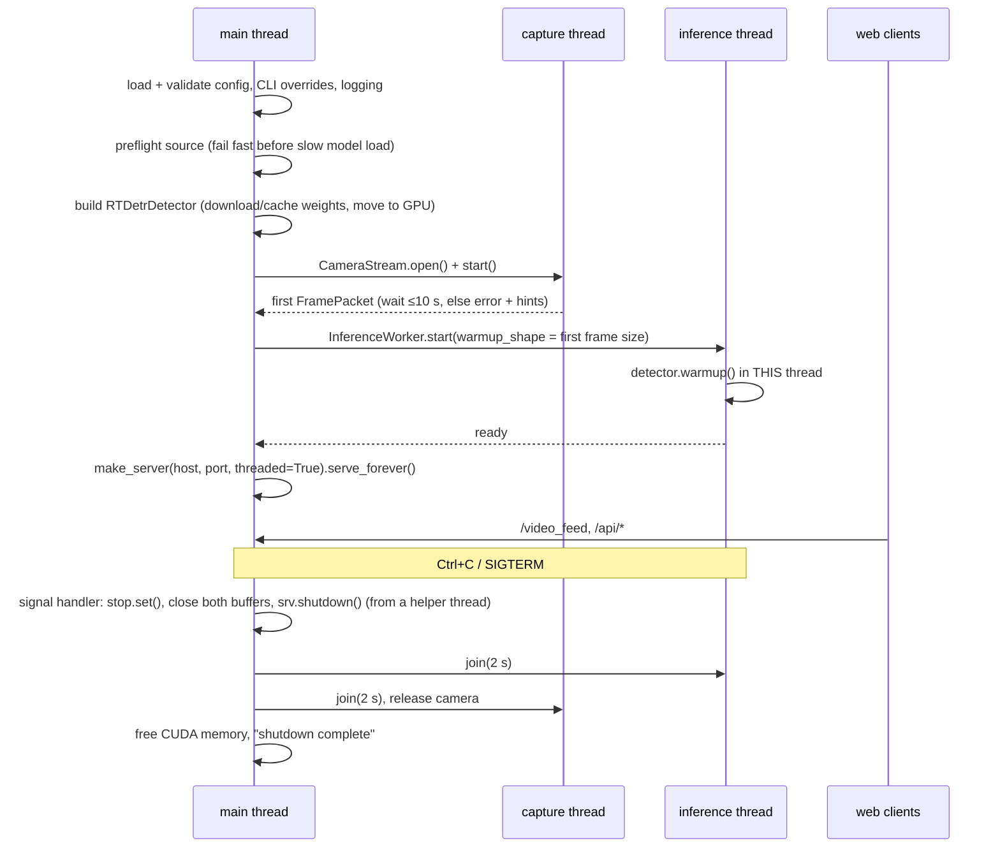

# Architecture

How the code fits together: the moving parts, the data that flows between them, and the few ideas that make the whole thing real-time.

## The big picture

The app is **one process with three threads** connected by two **single-slot buffers**:



Per frame, the path is:

```
camera ─read─▶ FramePacket ─put─▶ [frames] ─wait_newer─▶ detect ─▶ draw ─▶ JPEG ─put─▶ [results] ─wait_newer─▶ each browser
```

Everything is plain `threading`. OpenCV (capture, JPEG encode) and PyTorch CUDA kernels release the GIL, so the threads really do run in parallel where it matters.

## Key concepts

### 1. Latest-value-wins, never queue

`app/buffers.py` → `LatestValue[T]`

The central idea of the design. Between stages there is **one slot**, not a queue:

- `put(value)` overwrites the slot, bumps a **version counter** and wakes all waiters.
- `wait_newer(last_version, timeout)` blocks until something newer than what *this* reader last saw arrives.
- `get()` peeks without blocking (used by the JSON API).
- `close()` wakes everyone for shutdown.

Why: if inference is slower than the camera, a FIFO queue grows forever and latency grows with it. With one slot, the slow stage simply skips stale frames, so latency stays at about one processing period, however far behind it falls. (The slow-detector test shows this: with a 200 ms fake detector, e2e latency stays ~220–235 ms and doesn't drift.)

Each reader tracks its own `last_version`, so **any number of readers** can wait independently. That is how several browser tabs share one results slot.

### 2. Data packets

| Type | Defined in | Produced by → consumed by | Contents |
|---|---|---|---|
| `FramePacket` | `capture.py` | capture → inference | `frame_id`, `capture_ts` (monotonic), `image` (HxWx3 uint8 **BGR**) |
| `Detection` (frozen) | `detector.py` | detector → worker, API | `x1,y1,x2,y2` in **original-frame pixels**, `score`, `class_id`, `label`; `to_dict()` for JSON |
| `ResultPacket` | `pipeline.py` | inference → server | `frame_id`, `capture_ts`, `publish_ts`, `inference_ms`, `detections`, `jpeg` bytes, `width`, `height` |

The timestamps travel with the frame, so **end-to-end latency** is simply `publish_ts - capture_ts`, measured on one monotonic clock.

### 3. Encode once, serve many

The inference thread draws the boxes and encodes the JPEG **once** per frame, then puts the bytes in the results slot. Every `/video_feed` client just re-sends those same bytes. CPU cost doesn't grow with the number of viewers.

### 4. The detector is an interface

`app/detector.py` → `RTDetrDetector`. The rest of the app only relies on this surface:

```python
detect(frame_bgr) -> list[Detection]      # the hot path
warmup(h, w)                              # must run in the thread that calls detect()
set_threshold(t) / set_class_filter(names) # thread-safe, called live from the web UI
threshold, class_filter, labels, device, model_name, last_timings   # read-only properties
```

Because it is duck-typed, `tests/fakes.py::FakeDetector` stands in for it in the pipeline and server tests (no GPU needed), and a future `OnnxRTDetrDetector` could slot in without touching anything else.

### 5. One process, one camera handle

A camera device can only be opened once. So: no Flask reloader, no multi-worker server. `main.py` uses werkzeug's `make_server(..., threaded=True)` directly in the main thread.

## Module map

```
app/
├── main.py       entrypoint + lifecycle: wires everything, owns startup order and shutdown
├── config.py     YAML → typed dataclasses, validation, CLI overrides, logging setup
├── buffers.py    LatestValue[T]: the single-slot, versioned, multi-reader buffer
├── stats.py      RateMeter (events/s over ~2 s), LatencyMeter (mean/p95 over ~100 samples), PipelineMeters
├── capture.py    FramePacket, open_capture(), CameraStream (capture thread, reconnect, file pacing)
├── detector.py   Detection, RTDetrDetector (HF model, GPU preprocessing, fp16, filtering)
├── render.py     pure drawing functions: boxes, labels, HUD, output resize
├── pipeline.py   ResultPacket, InferenceWorker (inference thread: detect → draw → encode → publish)
└── server.py     AppState, create_app(): Flask routes (MJPEG stream + JSON API)
templates/index.html, static/app.js, static/style.css    browser UI (vanilla JS, no CDN, works offline)
scripts/          standalone tools: probe_camera, test_image, benchmark, headless_run
tests/            unit tests per module + a full end-to-end integration test
```

Dependency direction (arrows = "imports"):

```
main ──▶ config, buffers, stats, capture, detector, pipeline, server
server ──▶ buffers, stats                    (detector/camera/worker reached via AppState, duck-typed)
pipeline ──▶ buffers, stats, render, capture.FramePacket
capture ──▶ buffers, stats
detector ──▶ config.ModelConfig, torch, transformers
render ──▶ cv2 only                          (pure functions, trivially testable)
buffers, stats ──▶ stdlib only
```

Only `main.py` knows about every piece. No module-level mutable globals: shared state is passed in explicitly (constructor args, or `AppState` for the web layer).

## Component walkthrough

### `config.py`: configuration

- Dataclasses: `CameraConfig`, `ModelConfig`, `RenderConfig`, `ServerConfig`, `LoggingConfig`, grouped in `AppConfig`.
- `load_config(path)` reads `config.yaml` into those types, `apply_overrides(cfg, args)` applies `--source/--checkpoint/--device/--host/--port`, and `validate_config()` checks ranges (threshold in [0,1], positive sizes, known device, ...).
- Errors are raised as `ConfigError`. `main` turns them into a one-line message and exit code, with no traceback.

### `capture.py`: getting frames

- `classify_source()` decides whether a source is a device (`0`, `/dev/video0`), a file, or a URL. `open_capture()` picks the backend (V4L2 for devices, FFmpeg for files/URLs, RTSP over TCP) and sets properties **in the order UVC drivers need**: FOURCC → width → height → FPS → buffer size. It reads them back and logs what was actually negotiated.
- `CameraStream._run()` loop:
  - reads as fast as the device delivers; every good frame becomes a `FramePacket` → `frames.put()`, and the capture FPS meter ticks
  - **files** are paced to their native FPS (so they behave like a live camera) and loop at EOF
  - **read failures** are counted; after `max_consecutive_failures`, it releases, waits `reconnect_delay_s` and reopens (unplug/replug survival)
  - always releases the device in `finally`
- Friendly errors: missing device, permission denied (with the `video` group hint), or device busy.

### `detector.py`: the model

Loading (`__init__`):
1. Resolve the device (`auto` → `cuda` if available, else `cpu`), and load `AutoImageProcessor` + `AutoModelForObjectDetection` from Hugging Face (cached in `~/.cache/huggingface`).
2. Read the **processor config** (resize size, rescale factor, normalize or not) and set up the fast GPU preprocessing to match it exactly.
3. Build the label lookup from the checkpoint's `id2label`, with **COCO ↔ VOC aliases** (`motorcycle`↔`motorbike`, `couch`↔`sofa`, ...), because the PekingU checkpoints use VOC spellings.
4. Build the class filter as a boolean **mask tensor on the GPU**.

`detect(frame)`, the hot path:

```
upload (pinned host buffer → GPU, non_blocking)
→ BGR→RGB, resize to 640×640 (bilinear, antialias, rounded like the HF uint8 path), ×1/255   [~0.4 ms]
→ model forward under fp16 autocast                                                        [~17 ms r50]
→ logits/boxes cast to fp32
→ class mask applied to logits BEFORE top-K (so filtered classes can't crowd out wanted ones)
→ HF post_process_object_detection (sigmoid + top-K, boxes scaled to the original frame)
→ clamp boxes, sort by score, ONE .cpu().tolist() transfer                                 [~0.4 ms]
→ list[Detection]
```

Thread-safety uses two locks:
- `_settings_lock` guards threshold and mask, which the UI changes live; `detect` snapshots them at the start.
- `_infer_lock` serializes `detect` and `warmup`.

**Warmup gotcha:** CUDA and cuDNN handles are per thread. A warmup run in the main thread doesn't warm the inference thread, and its first call costs about 500 ms. So warmup runs **inside** `InferenceWorker`'s thread, and the detector logs a warning if `detect()` is called from a thread that was never warmed.

`use_reference_preprocess=True` switches to the Hugging Face CPU processor. The parity test uses it to prove the fast GPU path gives the same detections.

### `render.py`: drawing

Pure functions that take an image and return it, drawing **in place**. The frame belongs to the inference thread at that point, so no copy is needed.
- `color_for_class(id)` gives each class a stable color.
- `draw_detections()` draws each box with a filled label background, and moves the label inside the box when it would go above the top edge.
- `draw_hud()` draws the semi-transparent stats panel.
- `resize_for_output()` is optional downscaling, **after** drawing.
- `render_frame()` runs all three in order.

It is robust to empty lists, boxes partly outside the frame, degenerate boxes and NaNs.

### `pipeline.py`: the inference loop

`InferenceWorker._run()`:
1. Warm up the detector (in this thread) and then set `ready`. `main` waits on this before starting the web server.
2. Skip frames captured during warmup.
3. Loop:
   - `frames.wait_newer(last)` returns the newest frame. The number of skipped versions is counted as "dropped".
   - `process(pkt)`: `detect` → `render_frame` (with the HUD from the current meters) → `cv2.imencode(".jpg")` → `results.put(ResultPacket)` → update the meters.
   - Every 5 s, log one stats line, and warn if inference stays below 80% of capture FPS.
4. Every iteration is wrapped in `try/except`. A bad frame or CUDA OOM is logged, rate-limited by `_ErrorLimiter`, and the loop keeps going.

### `stats.py`: measuring

- `RateMeter.tick()` / `.rate()` gives events per second over a sliding ~2 s window. It's used for capture and inference FPS.
- `LatencyMeter.add(ms)` / `.mean()` / `.p95()` works over the last ~100 samples. It's used for inference ms and e2e ms.
- `PipelineMeters` bundles the four meters into one object that capture, worker, HUD and API all share. Everything is lock-protected.

### `server.py`: the web layer

`AppState` is the web layer's handle to the pipeline: config, both buffers, meters, detector, camera, worker, stop event, client counter. `create_app(state)` returns a Flask app whose routes are closures over it:

| Route | What it does |
|---|---|
| `GET /` | Serves the UI page |
| `GET /video_feed` | MJPEG generator per client: `results.wait_newer()` → yields the pre-encoded JPEG as a `multipart/x-mixed-replace` part; rate-capped by `max_stream_fps`; logs connect and disconnect |
| `GET /api/stats` | FPS, inference and e2e mean/p95, per-stage timings, device, model, capture info, uptime, client count |
| `GET /api/detections` | Latest `frame_id` + `Detection.to_dict()` list + age |
| `GET /api/labels` | All checkpoint labels + the driving preset in the checkpoint's own spelling |
| `GET/POST /api/settings` | Read or update `score_threshold` and `classes`; validated (400 on bad input), applied atomically with rollback |
| `GET /healthz` | 200 if both capture and inference produced output in the last 5 s, else 503 with details |

### The browser UI (`templates/` + `static/`)

- `` shows the stream; the browser natively renders MJPEG. On error, an overlay appears and it reconnects with backoff.
- Polling: `/api/stats` every 500 ms, `/api/detections` every ~200 ms.
- Controls: a threshold slider (debounced POST) and class checkboxes (from `/api/labels`) with *driving preset / all / none* buttons.
- Vanilla JS, no build step, no CDN, so it works offline in a car.

## Lifecycle (`main.py`)



Shutdown is coordinated by **one shared `threading.Event` (`stop`)** plus `LatestValue.close()`, which wakes any thread blocked in `wait_newer` immediately. Cleanup lives in a `finally`, so it runs on every exit path. A second Ctrl+C forces exit.

Exit codes: `0` OK, `1` runtime error (source can't open, model can't load, port in use), `2` config error. Errors print a readable message instead of a traceback.

## Performance model

For r50 on the RTX 5060 Ti at 1280×720 (numbers from the benchmark):

```
preprocess 0.4 ms │ forward 16.8 ms │ postprocess 0.4 ms │ render ~0.2 ms │ JPEG ~1.4 ms   ≈ 19 ms/frame
```

The camera delivers a frame every 40 ms (25 fps), so the GPU is ~50% busy and each frame is published ~19 ms after capture. Things that don't matter much: capture resolution (the model always sees 640×640), and the number of viewers (the JPEG is encoded once).

## Testing map

| Test file | Covers | Needs GPU/weights? |
|---|---|---|
| `test_buffers.py` | overwrite semantics, `wait_newer` timeout, concurrent readers, close | no |
| `test_render.py` | empty, out-of-frame, edge, tiny boxes, long labels, shape preserved | no |
| `test_capture.py` | source classification, open errors, clip read, file pacing and looping | clip only |
| `test_pipeline.py` | worker with `FakeDetector`, error resilience, latency bound with a slow detector | no |
| `test_server.py` | every route, MJPEG framing, settings validation (400s), healthz | no |
| `test_detector.py` | known image, `Detection` invariants, threshold/filter, **GPU vs HF parity** | yes (skips otherwise) |
| `test_integration.py` | real `python -m app.main` on the clip, random port, curl-style checks | yes + clip |

`tests/fakes.py` provides `FakeDetector`, which has the same surface as `RTDetrDetector` with a configurable delay. It lets everything except the detector be tested without a GPU.

## Where to extend

| You want to... | Touch |
|---|---|
| Use a different model runtime (ONNX, TensorRT) | New class with the `RTDetrDetector` surface; choose it in `main.build_detector()` |
| Add a new camera type | `capture.classify_source()` / `open_capture()` |
| Draw boxes client-side instead | New route streaming `/api/detections` via SSE; the canvas in `app.js` |
| Record video or detections | A second reader on `results` (another `wait_newer` loop); no changes to the pipeline |
| Add object tracking | Between `detect()` and `render_frame()` in `InferenceWorker.process()` |
